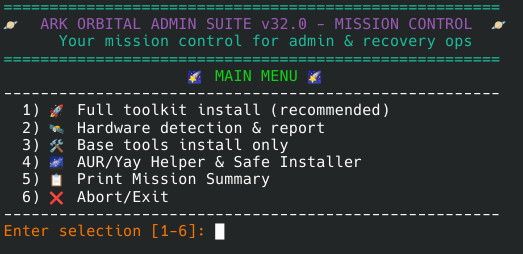
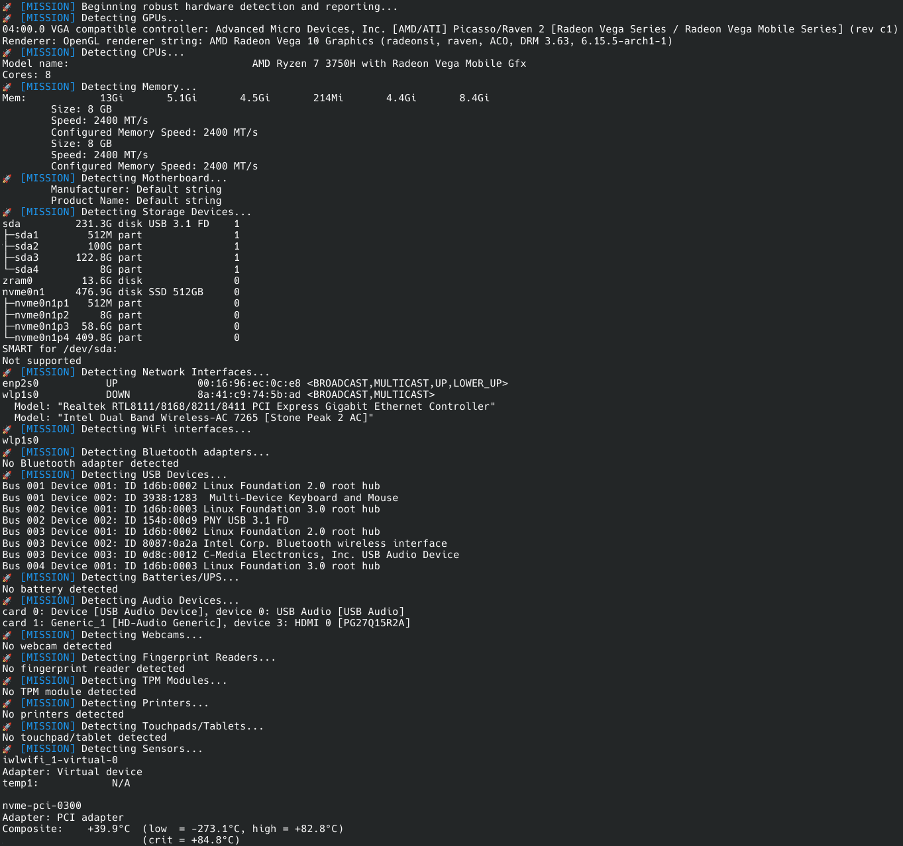

# 🪐 ARK ORBITAL ADMIN SUITE

**Mission Control for Admin & Recovery Operations**  
Author: [koobie777](https://github.com/koobie777)

---

## 🚀 About

ARK Orbital Admin Suite is your all-in-one, interactive mission control for Linux system administration and recovery.  
With robust hardware detection, guided toolkit installation, safe AUR package management, and cosmic style, it’s built for sysadmins, tinkerers, and rescue missions of all kinds.

---

## 🌠 Features

- **Interactive, Menu-Driven UI**  
  Easy full-screen terminal menus with clear options and emoji indicators.
- **Full Toolkit Install**  
  Installs essential packages for diagnostics, recovery, repair, and daily ops.
- **Advanced Hardware Detection**  
  Detects and reports on CPUs, GPUs, RAM, storage, network, peripherals & more.
- **Safe AUR/Yay Helper**  
  Switches to user context for AUR package install—never runs yay as root!
- **Mission Debrief & Summary**  
  Prints a summary and inspirational space quotes at the end of your mission.
- **Cross-Platform Ambitions**  
  Currently best on Arch Linux. Plans for Windows, macOS, and other distros coming soon!

---

## ⚠️ Platform Recommendation

**This suite is currently recommended for Arch Linux and compatible distributions.**  
Support for Windows, macOS, and additional Linux distros is planned for future releases.

---

## 📝 Usage

```bash
# Make executable
chmod +x install-admin-recovery-tools-v32.0.sh

# Run as root (for full toolkit and hardware detection)
sudo ./install-admin-recovery-tools-v32.0.sh

# Or as a regular user (for AUR/yay helper menu)
./install-admin-recovery-tools-v32.0.sh
```

### Main Menu

- `1) 🚀 Full toolkit install` — Installs all base tools, runs hardware detection, and launches safe AUR helper.
- `2) 🛰️ Hardware detection & report` — Robust hardware and device scan.
- `3) 🛠️ Base tools install only` — Installs only core admin/recovery tools.
- `4) 🌌 AUR/Yay Helper & Safe Installer` — User-mode AUR management.
- `5) 📋 Print Mission Summary` — See what was detected and installed.
- `6) ❌ Abort/Exit` — End the session.

---

## 💫 Screenshots




---

## 💡 Notes & Requirements

- **Target OS:** Arch Linux and derivatives (for now)
- **Requires:** bash, sudo, standard GNU tools, yay (for AUR features)
- **Optional:** Many features will gracefully degrade if some commands are missing.

---

## 🛠️ Contributing

Pull requests welcome! Please report issues or suggest features.  
Cosmic quotes and menu ideas always appreciated.

---

## 📜 License

[MIT](LICENSE)

---

## 🌌 Space Quotes (a few included):

> "To confine our attention to terrestrial matters would be to limit the human spirit." – Stephen Hawking  
> "We are made of star-stuff." – Carl Sagan  
> "The sky is not the limit. Your mind is." – Marilyn Monroe  

---

**Happy hacking, and may your system always boot!**  
🪐
